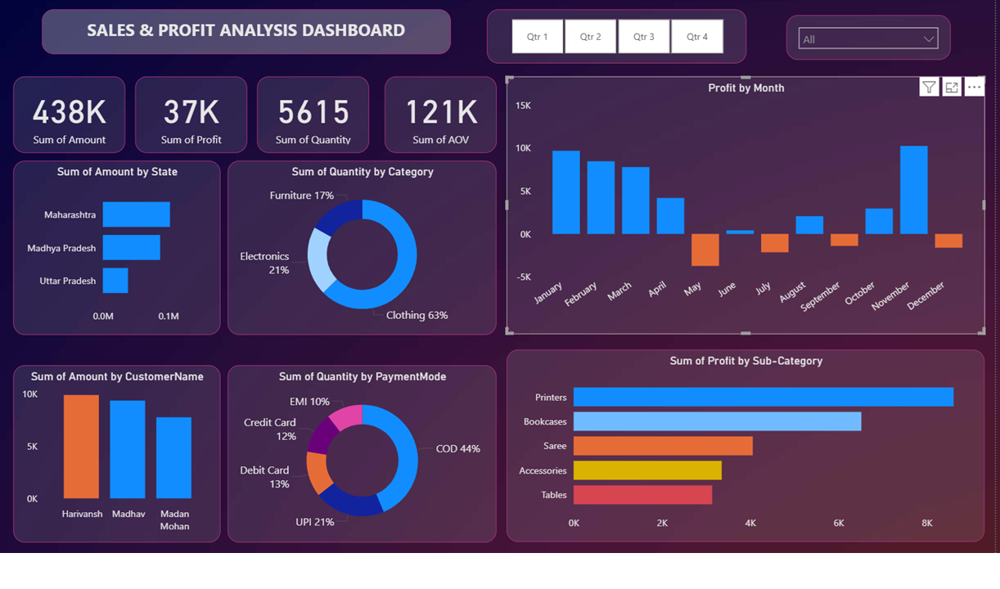

# Sales & Profit Analysis Dashboard

This Power BI dashboard shows sales and profit analysis for an e-commerce company.

### What I Did
- Used Power BI to analyze 438K+ sales data
- Made 4 KPI cards and 6 charts
- Found which products and states make the most money

### Main Findings
- **Total Sales:** 438K
- **Total Profit:** 37K
- **Total Quantity:** 5615
- **Best Category:** Clothing = 63% of all sales
- **Top Payment:** Cash on Delivery = 44%
- **Top State:** Maharashtra

### Tools Used
Power BI, DAX

### Dashboard Image

